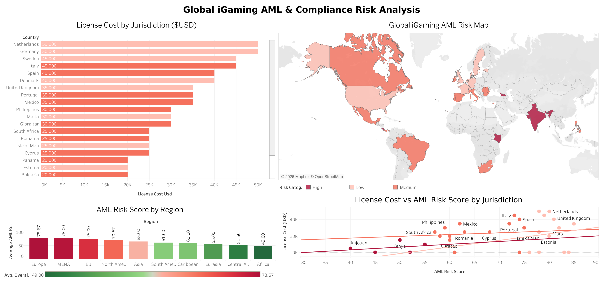
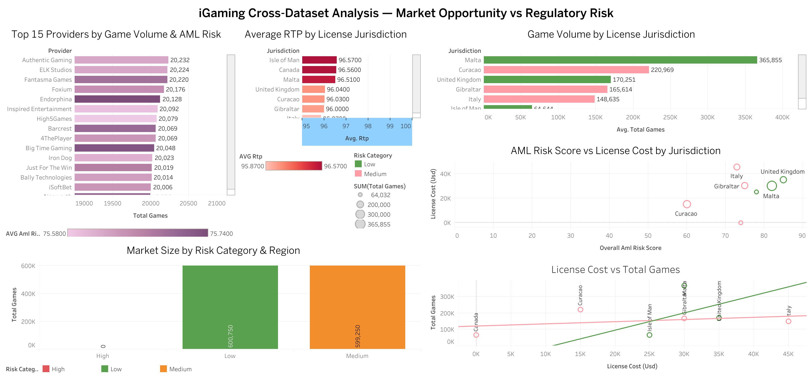

# iGaming BI Analytics Portfolio
A collection of data analysis projects focused on the iGaming industry, built to demonstrate BI analytics skills using real-world datasets.

## ⭐️ About
This portfolio showcases end-to-end analytics work including SQL data extraction, interactive dashboards, and business insights — targeting roles in iGaming analytics.

## ⭐️ Stack
- **SQL** (SQLite) — data extraction and transformation
- **Tableau Public** — interactive dashboards
- **GitHub** — version control and portfolio hosting

---

## ⭐️ Cases

### [Case 01 — Online Casino Games Market Analysis](case-01-casino-market/README.md)
Analysis of 1.2M+ casino game records across 80 casinos and 57 countries.
> Tools: SQL · Tableau Public
> Dataset: 1,200,000 records | 80 Casinos | 57 Countries | 7 Game Types

🔗 [View Dashboard](https://public.tableau.com/views/OnlineCasinoGamesMarketAnalysis/Dashboard1)

---

### [Case 02 — 1xBet Financial Performance Analysis](case-02-1xBet-financial-performance-analysis/README.md)
Analysis of 35,000+ gaming sessions to identify revenue patterns and player behavior.
> Tools: SQL · Tableau Public
> Dataset: 34,863 gaming sessions | April 2024

🔗 [View Dashboard](https://public.tableau.com/views/1xBetFinancialPerformanceAnalysis/1xBetFinancialPerformanceAnalysis)

---

### [Case 03 — Global iGaming AML & Compliance Risk Analysis](case-03-aml-compliance/README.md)
Regulatory risk mapping across 34 global iGaming jurisdictions.
> Tools: SQL · Tableau Public
> Dataset: 34 jurisdictions | 20 compliance indicators | Global coverage

🔗 [View Dashboard](https://public.tableau.com/views/GlobaliGamingAMLComplianceRiskAnalysis/Dashboard1)

---

### [Case 04 — Cross-Dataset Analysis: Market Opportunity vs Regulatory Risk](case-04-cross-dataset-analysis/README.md)
Cross-dataset JOIN analysis combining Casino Market and AML Compliance data across 7 jurisdictions.
> Tools: SQL · Tableau Public
> Datasets: 1,200,000 casino records + 34 AML jurisdictions

🔗 [View Dashboard](https://public.tableau.com/views/iGamingCross-DatasetAnalysisMarketOpportunityvsRegulatoryRisk/iGamingCross-DatasetAnalysisMarketOpportunityvsRegulatoryRisk)

---

## ⭐️ Dashboards Preview

| Case | Dashboard |
|---|---|
| Casino Market Analysis |  |
| 1xBet Financial Analysis |  |
| AML Compliance Analysis |  |
| Cross-Dataset Analysis |  |
